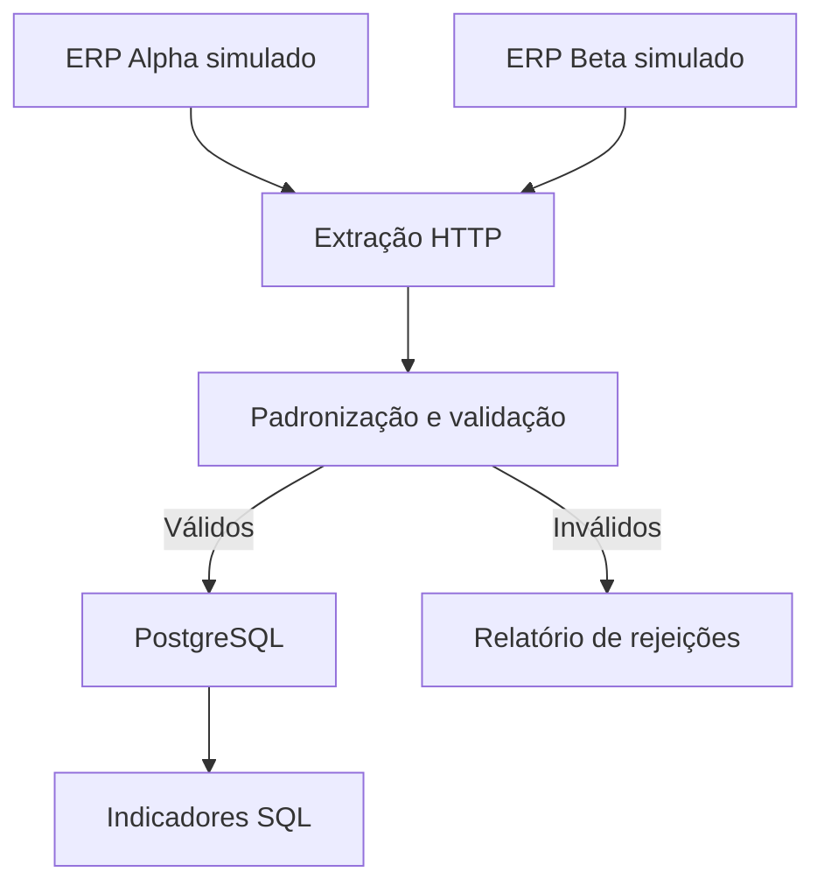

# FinanceFlow ETL

## Guia de implementação e estudo

Este documento define o projeto de portfólio de Lucas Nascimento Ferreira: um pipeline em Python que integra transações de dois sistemas financeiros simulados, padroniza e valida os dados, persiste em PostgreSQL e calcula indicadores com SQL. A construção será feita em etapas com o Codex; Lucas revisará cada entrega e reconstruirá o problema durante a semana para consolidar o aprendizado.

O alvo é demonstrar integração de sistemas e qualidade de dados no contexto descrito para a oportunidade na IZE. Este projeto não usa dados, credenciais ou APIs reais da empresa. Os contratos abaixo são definidos para a demonstração, sem representar Conta Azul, Omie ou outro ERP comercial.

### Como começar agora

1. Abra o repositório `financeflow-etl` no Codex e anexe este arquivo Markdown.
2. Envie o prompt inicial da seção 9 deste guia. Ele autoriza somente a etapa 1.
3. Confira os comandos e resultados apresentados pelo Codex. Envie para nossa conversa o resumo, eventuais erros e o link do repositório.
4. Avance para a próxima etapa depois de conseguir executar e explicar a entrega anterior.

Os comandos deste guia são interfaces que o projeto deverá implementar. Eles ainda não foram executados no seu repositório. Ao terminar cada etapa, o Codex deve registrar os comandos realmente executados e os resultados observados.

## 1 Escopo e prioridades

### Entrega principal

Construir APIs paginadas com schemas diferentes; consumir com Requests; transformar com Pandas; validar e separar rejeições; carregar com Psycopg em PostgreSQL; consultar indicadores com SQL. O núcleo precisa funcionar pela linha de comando, sem depender do Airflow.

### Depois do núcleo

Adicionar uma DAG do Airflow que reutilize as mesmas funções. Se houver tempo, criar um painel simples com Streamlit lendo as consultas SQL. A consulta dos indicadores pelo terminal já permite demonstrar o pipeline antes do painel.

### Limites desta primeira versão

Dados sintéticos em BRL, em pequeno volume. A execução reprocessa o conjunto completo das duas fontes. Não há integração real com ERP, implantação em nuvem, conciliação entre sistemas, dados pessoais, OAuth, streaming ou garantia de produção. Checkpoint de paginação fica para uma evolução: neste MVP, a recuperação é reiniciar a coleta completa e fazer carga idempotente.

### Fluxo



## 2 Contratos das fontes

Um serviço FastAPI expõe os dois ERPs em `http://localhost:8000`. Dentro da rede Docker, o hostname será `mock-api`. Todas as respostas são determinísticas e os valores monetários chegam como strings, preservando centavos. Ordenar os registros por ID para manter a paginação estável.

### ERP Alpha

Endpoint `GET /alpha/transactions?page=1&page_size=2`, com `page` a partir de 1. A resposta tem `data` e `next_page`; `next_page=null` encerra a coleta. Autenticação por `Authorization: Bearer <token de demonstração>` configurado no ambiente.

```json
{
  "data": [{
    "id": "A-1",
    "company_id": "C1",
    "description": "Serviço de setembro",
    "amount": "3000.00",
    "category": "SERVICOS",
    "competence_date": "2026-09-30",
    "payment_date": "2026-10-02",
    "status": "PAID"
  }],
  "next_page": 2
}
```

No Alpha, valor positivo indica receita e negativo indica despesa. `PAID`, `OPEN` e `CANCELED` são os estados aceitos. Um token ausente ou errado deve gerar HTTP 401.

### ERP Beta

Endpoint `GET /beta/lancamentos?pagina=1&limite=2`. A resposta tem `lancamentos`, `pagina` e `total_paginas`. Autenticação por `X-API-Key`, também configurada no ambiente.

```json
{
  "lancamentos": [{
    "codigo": "B-1",
    "empresa": "C1",
    "historico": "Venda de outubro",
    "valor": "2500,00",
    "tipo": "RECEITA",
    "categoria": "SERVICOS",
    "competencia": "02/10/2026",
    "pagamento": "03/10/2026",
    "situacao": "PAGO"
  }],
  "pagina": 1,
  "total_paginas": 2
}
```

No Beta, `valor` é positivo e `tipo` define `RECEITA` ou `DESPESA`. O contrato admite vírgula decimal e nenhum separador de milhar. Traduzir `PAGO`, `ABERTO` e `CANCELADO` para os mesmos estados do Alpha. Tipos ou estados desconhecidos devem ser rejeitados.

### Falhas controladas

Criar um modo de demonstração separado das fixtures normais para devolver HTTP 503 uma vez numa página intermediária, e outro modo para falhar permanentemente. Documentar como ativar e reiniciar esses cenários. Usar timeout de conexão e leitura, até 3 retries além da tentativa inicial e espera progressiva. Aplicar retries somente a GET e erros transitórios; não repetir 401 ou 403. Respeitar `Retry-After` em 429.

Não encerrar a coleta como se tivesse sucesso após uma exceção. Detectar páginas repetidas, ausência de progresso e ultrapassagem de um limite configurável de páginas.

## 3 Modelo único e regras de negócio

### Campos persistidos

| Campo | Tipo no PostgreSQL | Regra |
| --- | --- | --- |
| company_id | TEXT | Obrigatório; empresa do lançamento |
| source_system | TEXT | alpha ou beta |
| transaction_id | TEXT | ID original convertido para string |
| description | TEXT | Texto não vazio após trim |
| amount | NUMERIC(18,2) | Magnitude positiva em BRL |
| transaction_type | TEXT | revenue ou expense |
| category | TEXT | Categoria padronizada; ausente vira SEM_CATEGORIA |
| competence_date | DATE | Data de competência obrigatória |
| payment_date | DATE | Obrigatória para paid; nula para open e canceled |
| status | TEXT | paid, open ou canceled |
| inserted_at | TIMESTAMPTZ | Primeira carga; preservada no reprocessamento |
| updated_at | TIMESTAMPTZ | Alterada somente quando o conteúdo muda |

A chave única é `(company_id, source_system, transaction_id)`. IDs iguais em empresas ou fontes distintas não são automaticamente duplicatas. Se a mesma operação aparecer nos dois ERPs, este MVP a considera dois registros: conciliação entre fontes fica fora do escopo e deve ser informada no README.

### Transformação

No Alpha, converter o sinal em `transaction_type` e salvar a magnitude positiva. No Beta, usar `tipo` e converter a vírgula decimal. Datas do Alpha seguem ISO; as do Beta seguem estritamente dia/mês/ano. Não inferir uma data de pagamento a partir da competência.

Usar `Decimal` no Python e `NUMERIC` no banco. Pandas organiza os dados, aplica mapeamentos e identifica duplicatas, preservando os valores monetários como Decimal ou strings. Não converter dinheiro para float. Rejeitar valor zero, não numérico, não finito ou com mais de duas casas decimais; não arredondar silenciosamente.

Rejeitar IDs ou empresas ausentes, descrição vazia, datas inválidas e combinações incompatíveis de status e pagamento. Cada rejeição deve informar fonte, ID disponível, motivo e registro original em `data/runs/<run_id>/rejected.jsonl`.

Duplicatas com a mesma chave e conteúdo idêntico são reduzidas a uma linha. Se a mesma chave tiver conteúdos divergentes dentro da coleta, rejeitar todos os registros dessa chave e registrar conflito; não escolher uma versão arbitrariamente. Em uma execução futura, um único registro válido com a mesma chave poderá atualizar o registro persistido.

### Competência e caixa

Criar indicadores separados. Na visão por competência, considerar receitas e despesas não canceladas pela `competence_date`, incluindo itens em aberto. Na visão de caixa, considerar somente itens `paid` pela `payment_date`. Saldo do período significa entradas menos saídas no período; não é o saldo bancário acumulado. A visão por competência é uma simplificação demonstrativa de lançamentos, não uma DRE contábil completa.

## 4 Fixtures e resultados de referência

Todos os registros abaixo pertencem à C1. Valores são magnitudes em BRL; o Alpha deve retornar despesas com sinal negativo. Na resposta Beta, usar vírgula decimal e datas brasileiras.

| Fonte e ID | Tipo | Valor | Competência | Pagamento | Estado |
| --- | --- | --- | --- | --- | --- |
| alpha A-1 | receita | 3000,00 | 30/09/2026 | 02/10/2026 | paid |
| alpha A-2 | despesa | 1200,00 | 01/10/2026 | 03/10/2026 | paid |
| alpha A-3 | receita | 500,00 | 02/10/2026 | nulo | open |
| beta B-1 | receita | 2500,00 | 02/10/2026 | 03/10/2026 | paid |
| beta B-2 | despesa | 800,00 | 30/09/2026 | 01/10/2026 | paid |
| beta B-3 | despesa | 200,00 | 04/10/2026 | nulo | canceled |

Repetir A-2 uma vez, com conteúdo idêntico, e adicionar alpha A-X com valor `abc`. A coleta normal terá 8 registros brutos: 6 válidos únicos, 1 duplicata removida e 1 rejeição. A linha cancelada é persistida, mas não participa dos indicadores.

| Indicador da C1 | Receitas ou entradas | Despesas ou saídas | Saldo do período |
| --- | --- | --- | --- |
| Competência setembro de 2026 | 3000,00 | 800,00 | 2200,00 |
| Competência outubro de 2026 | 3000,00 | 1200,00 | 1800,00 |
| Caixa outubro de 2026 | 5500,00 | 2000,00 | 3500,00 |

Esses totais são a referência para os testes; não calcular o resultado esperado chamando a própria função que está sendo testada. Acrescentar empresas, chaves repetidas entre fontes e dados conflitantes apenas em fixtures de testes separadas, preservando os totais da demonstração.

## 5 Organização e interface de execução

### Arquivos previstos

| Caminho | Responsabilidade |
| --- | --- |
| pyproject.toml e arquivo de dependências fixadas | Pacote instalável financeflow e versões reproduzíveis |
| src/financeflow/config.py | Leitura e validação de ambiente |
| src/financeflow/extract.py | Clientes HTTP e paginação de cada fonte |
| src/financeflow/transform.py | Mapeamento para o modelo único |
| src/financeflow/validate.py | Validação, duplicatas e rejeições |
| src/financeflow/load.py | Transação e upsert no PostgreSQL |
| src/financeflow/pipeline.py | Coordenação das etapas e resumo da execução |
| src/financeflow/__main__.py | Comandos run e kpis |
| mock_api/main.py e fixtures/ | Serviço FastAPI e dados sintéticos |
| sql/schema.sql e sql/kpis.sql | Estrutura, restrições e indicadores |
| tests/ | Testes unitários e de integração |
| Dockerfile e compose.yaml | Serviços postgres, mock-api e etl |
| dags/financial_pipeline.py | DAG adicionada depois do núcleo |
| compose.airflow.yaml | Ambiente separado de orquestração |
| README.md e docs/decisions.md | Como executar, decisões e limitações |

Fixar versões compatíveis após resolver e testar as dependências. Usar Python 3.12 nos containers. Escolher uma versão suportada de PostgreSQL e fixar a imagem usada. Não usar tags `latest`. Airflow terá imagem e dependências próprias, evitando instalar sua árvore de dependências no ambiente básico do pipeline.

### Comandos que deverão funcionar após a etapa 4

```bash
cp .env.example .env
docker compose up -d postgres mock-api
docker compose run --rm etl python -m financeflow run
docker compose run --rm etl python -m financeflow kpis
```

O serviço etl precisa estar definido no Compose e seu volume `data/` deve preservar os relatórios. Criar `.env.example` com valores locais fictícios; ignorar `.env`, `.venv`, logs e resultados de execução no Git. O README deverá explicar os comandos de teste da imagem que efetivamente for construída.

## 6 Etapas de construção

### Etapa 1 APIs simuladas e estrutura

Preparar o pacote instalável, FastAPI, fixtures definidas neste guia, paginação, autenticação de demonstração, `/health`, Dockerfile e Compose mínimo com mock-api. Criar README inicial com o status em desenvolvimento e `.env.example`.

Conferir: API sobe; token errado retorna 401; todas as páginas retornam os 8 registros brutos; página final encerra corretamente; o resultado não muda ao reiniciar. Testar os dois contratos, não apenas `/health`.

Você precisa explicar: o que é uma API; para que servem header e query parameter; por que existem schemas diferentes; como o coletor sabe que terminou.

Prompt de continuidade: "Implemente somente a etapa 1 do guia anexado. Valide os dois contratos, execute os testes relevantes e mostre os comandos para subir a API e consultar uma página de cada fonte."

### Etapa 2 Extração

Criar clientes Requests por fonte, configuração via ambiente, timeout, retries delimitados e verificação do status HTTP. Persistir respostas coletadas por execução e um manifesto que indique se ambas as fontes terminaram. Somente um manifesto completo autoriza as etapas seguintes. Não registrar tokens em logs.

Conferir: coleta paginada completa; falha transitória recuperada; falha permanente termina com erro e não segue para carga; 401 falha sem repetição. Não apresentar uma coleta incompleta como sucesso.

Você precisa explicar: diferença entre timeout e retry; quais falhas vale repetir; o que aconteceria se a página 2 falhasse.

Prompt de continuidade: "Implemente somente a etapa 2. Reutilize as APIs e fixtures existentes. Teste paginação, 401, 503 transitório e 503 permanente. Persista o manifesto de coleta completa e registre tentativas sem expor credenciais."

### Etapa 3 Transformação e qualidade

Aplicar as regras de normalização, Decimal, datas, status, categorias, chave composta, duplicatas e conflitos. Gerar dataset válido e relatório de rejeições por run_id, sem tocar no banco financeiro ainda. Manter funções testáveis sem Docker ou Airflow.

Conferir: 8 brutos produzem 6 válidos únicos, 1 duplicata e 1 rejeição; datas e valores corretos; IDs iguais de empresas diferentes preservados; cancelados mantidos no dataset; conflitos rejeitados com motivo explícito.

Você precisa explicar: extração versus transformação; por que dinheiro não usa float; o que define uma duplicata; por que competência e pagamento têm campos separados.

Prompt de continuidade: "Implemente somente a etapa 3. Use Pandas sem converter dinheiro para float e cumpra todas as regras da seção 3. Crie testes com valores esperados independentes e apresente dados antes e depois da transformação."

### Etapa 4 PostgreSQL e indicadores

Adicionar PostgreSQL ao Compose, schema com restrições, carga via Psycopg e SQL parametrizado. Fazer upsert pela chave composta dentro de uma transação única para o conjunto válido das duas fontes. Em erro de carga, fazer rollback de todos os registros financeiros da execução. Preservar inserted_at e atualizar updated_at apenas quando houver mudança de conteúdo.

Disponibilizar `python -m financeflow run` e `python -m financeflow kpis`. Ao final, emitir resumo com run_id, brutos, válidos únicos, duplicatas, rejeições, registros processados na carga, duração e status. Execuções com rejeições devem indicar sucesso com rejeições; falhas de fonte ou banco devem sair com código diferente de zero.

Conferir: carga inicial com 6 linhas; nova execução mantém as mesmas 6 linhas e os mesmos indicadores; atualização de valor muda uma linha existente; interrupção da carga faz rollback; consultas retornam os três totais definidos na seção 4. O modelo não apaga registros que desaparecerem de uma fonte: exclusões exigiriam um contrato adicional.

Você precisa explicar: INSERT versus UPDATE; chave única; upsert; transação e rollback; por que SQL de caixa filtra por pagamento.

Prompt de continuidade: "Implemente somente a etapa 4. Use PostgreSQL real nos testes de carga. Comprove execução repetida sem duplicação, atualização de registro, rollback e os indicadores de referência. Entregue os comandos completos do Compose."

### Etapa 5 Airflow

Com o núcleo funcionando, integrar Airflow em Compose separado usando uma versão estável fixada e o exemplo oficial correspondente como referência. Adaptar os comandos de inicialização à versão escolhida, sem misturar configuração de Airflow 2 e 3. Fazer smoke test de importação da DAG e uma execução real.

A DAG deve coordenar `extract → transform_validate → load → report`, reutilizando o pacote. Agendamento diário, `catchup=False`, `max_active_runs=1` e retries limitados. Em falha de extração, as tarefas de carga e relatório de sucesso não devem executar.

Persistir os arquivos de cada execução em volume compartilhado entre os containers que executam tarefas. Passar por XCom somente run_id, caminhos e contagens; não transportar datasets ou DataFrames. Retentar uma tarefa deve usar os mesmos caminhos daquela execução. Instalar o pacote e as dependências na imagem do Airflow e separar o banco de metadados do banco financeiro por database e usuário.

Conferir: DAG importa sem erro; execução real termina; rerun preserva 6 transações e os indicadores; arquivos ficam acessíveis à tarefa seguinte; falha de fonte impede carga. Apenas conseguir listar a DAG não comprova que o pipeline rodou.

Você precisa explicar: o papel do scheduler; tarefa versus DAG; retry da tarefa versus retry HTTP; idempotência; por que o banco de metadados não é o banco financeiro.

Prompt de continuidade: "Implemente somente a etapa 5 usando a documentação oficial da versão escolhida. Reutilize o pipeline já validado. Comprove uma execução real, uma repetição idempotente e o bloqueio da carga após falha de extração."

### Etapa 6 Apresentação e revisão

Reescrever o README em português com problema, arquitetura, tecnologias realmente usadas, quickstart testado, exemplos antes/depois, indicadores de referência, testes executados e limitações. Registrar decisões curtas em docs/decisions.md: Decimal, chave composta, competência versus caixa, reprocessamento completo e atomicidade da carga.

Se houver tempo, criar painel Streamlit simples com filtro de empresa e período, visão de competência, visão de caixa e despesas por categoria. O painel deve consultar o PostgreSQL, não ler números fixos das fixtures. Identificar todos os dados como sintéticos. Streamlit é opcional e não entra como requisito para a entrega principal.

Conferir: uma pessoa consegue executar seguindo o README; links funcionam; screenshots mostram números gerados pela execução local; nada é anunciado como concluído sem demonstração. GitHub Actions pode executar testes unitários e de integração com PostgreSQL; não precisa subir todo o Airflow no CI.

Prompt de continuidade: "Finalize a etapa 6 com base no que realmente foi implementado e testado. Confira o quickstart, documente limitações e apresente um roteiro de demonstração de três minutos. Não crie o painel opcional antes de fechar essas verificações."

## 7 O que fazer se o tempo apertar

Prioridade: fechar a etapa 4 com coleta completa, normalização, banco, testes e indicadores. Em seguida, integrar Airflow. Melhor um núcleo demonstrável com orquestração claramente pendente do que anunciar recursos sem execução comprovada.

Se o Airflow travar, registrar o erro e a versão usada, manter o comando de linha funcionando e investigar o problema de infraestrutura em separado. O README e o currículo devem refletir o estado real.

## 8 Reconstrução para aprender durante a semana

Reimplementar em um repositório privado sem copiar os módulos prontos. Manter os mesmos contratos e resultados de referência para comparar comportamento.

1. Consumir manualmente uma página de cada API e explicar os JSONs.
2. Escrever normalização e validação de duas transações, inclusive Decimal e datas.
3. Adicionar paginação, duplicatas, rejeições e testes.
4. Escrever schema, INSERT, UPDATE, upsert e consultas SQL; executar duas cargas.
5. Criar a DAG e demonstrar recuperação de uma falha.

Cada sessão termina com uma explicação em suas palavras: qual problema foi resolvido, que alternativa foi considerada e como você verificou o resultado. Se você não conseguir explicar uma função do projeto público, ela vira o próximo exercício.

### Roteiro de demonstração

Mostrar primeiro os JSONs diferentes; executar o pipeline; consultar os indicadores; repetir a carga e provar que a contagem permanece igual. Mostrar uma rejeição e uma falha de API. Por último, apresentar a DAG, quando estiver funcionando.

### Perguntas que você deve conseguir responder

- Como você sabe que coletou todas as páginas?
- O que acontece se uma fonte falhar no meio da extração?
- Por que a chave contém empresa e sistema de origem?
- Uma transação presente nos dois ERPs será contada duas vezes?
- Como um valor atualizado substitui o anterior sem duplicar a linha?
- Por que o resultado de caixa difere do resultado por competência?
- Onde os dados inválidos ficam e como você investiga o motivo?
- Como você prova que o indicador está correto?
- O que o Airflow faz que o seu script sozinho não faz?
- O que precisaria mudar para trabalhar com dados reais e maior volume?

## 9 Prompt inicial para enviar ao Codex

```text
Vamos construir FinanceFlow ETL no repositório aberto. O guia anexado é a especificação do projeto. Leia-o por completo e confira as instruções AGENTS.md existentes antes de editar.

Nesta rodada, implemente somente a etapa 1: pacote financeflow instalável, mock FastAPI de dois ERPs, fixtures determinísticas da seção 4, paginação e autenticação conforme a seção 2, /health, Dockerfile, Compose mínimo do mock-api, .env.example e README inicial.

Não implemente ainda os coletores, ETL, banco, Airflow ou dashboard. Preserve arquivos existentes e use código simples, com nomes em inglês e documentação em português. Não adicione credenciais reais.

Escreva e execute testes úteis dos dois contratos: paginação completa, encerramento, autenticação e os 8 registros brutos esperados. Suba o mock e faça smoke test HTTP se o ambiente permitir. Se algo não puder ser executado, informe exatamente o impedimento, sem apresentar como validado.

Ao terminar, entregue: arquivos alterados; comandos exatos para eu executar; resultados dos testes; exemplo de resposta de cada ERP; e uma explicação curta de paginação, autenticação e organização do projeto. Prepare as alterações para revisão e deixe o avanço para a etapa 2 para a próxima rodada.
```

## 10 Documentação técnica consultada

Referências oficiais consultadas em 4 de outubro de 2026. Ao implementar, consultar a página correspondente à versão efetivamente fixada no projeto.

- Requests, sessões, retries e timeout: https://requests.readthedocs.io/en/stable/user/advanced/
- PostgreSQL, INSERT e ON CONFLICT: https://www.postgresql.org/docs/current/sql-insert.html
- PostgreSQL, tipos numéricos: https://www.postgresql.org/docs/current/datatype-numeric.html
- Psycopg, conversão de tipos Python: https://www.psycopg.org/psycopg3/docs/basic/adapt.html
- Apache Airflow, ambiente Docker: https://airflow.apache.org/docs/apache-airflow/stable/howto/docker-compose/

Os requisitos e as fixtures deste guia são decisões de projeto; as referências apoiam o uso das ferramentas, não atestam uma implementação que ainda será construída.
